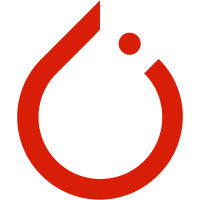

## Hi, I'm <a href="https://juliusyang97.github.io/" target="_blank">JUNQI YANG </a> 👋

 <em><b>I love connecting with different people</b> so if you want to say <b>hi, I'll be happy to meet you more!</b> :)</em>

 

<!--
**juliusyang97/juliusyang97** is a ✨ _special_ ✨ repository because its `README.md` (this file) appears on your GitHub profile.

Here are some ideas to get you started:

- 🔭 I’m currently working on ...
- 🌱 I’m currently learning ...
- 👯 I’m looking to collaborate on ...
- 🤔 I’m looking for help with ...
- 💬 Ask me about ...
- 📫 How to reach me: ...
- 😄 Pronouns: ...
- ⚡ Fun fact: ...
-->

  <a href="https://github.com/juliusyang97" class="rich-diff-level-one">
    
    <!-- &hide=issues
    
    -->
  </a>

  
  &emsp;
  
  &emsp;
  
  &emsp;
  
  &emsp;
  
  &emsp;
  
  &emsp;
  
  &emsp;
  <a href="https://www.linkedin.com/in/juliusyang97/" target="_blank" title="LinkedIn">
    
  &emsp;
   
  </a>
    
  <strong>Check out my work below!</strong>
    
  
  
  
  
  

<h2></h2>

 &nbsp;&nbsp;&nbsp;&nbsp;

**Languages and Frameworks**

<code></code>
<code></code>
<code></code>
<code></code>
<code></code>
<code></code>

<code></code>

**Tools and Environments**

<code></code>
<code></code>
<code></code>
<code></code>
<code></code>
<code></code>
<code></code>
<code></code>
<code></code>
<code></code>

---

🚧 **My Todolist Stats: ⬇️**
<!--
<<<<<<< HEAD
&nbsp;&nbsp;&nbsp;)
-->

>>>>>>> 
